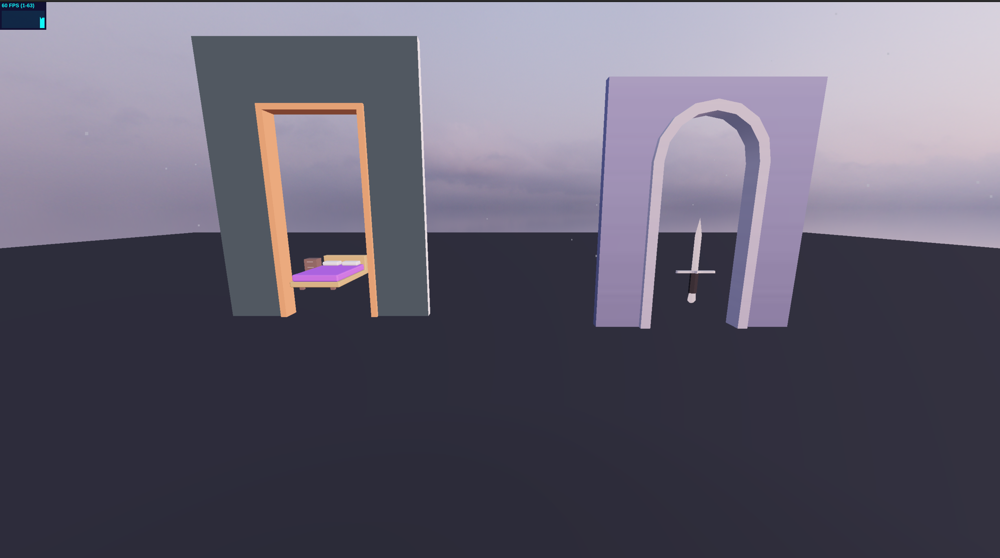

# WebGL Final Project - Interactive 3D Scene Selector (Ozzie's Morning Choice)

> PS: PLEASE RELOAD EACH PAGE as you navigate  

## The Idea

I wanted to create something that was connected to my experience rather than just a technical demo. The concept of a "magical portal system" came from wanting to showcase multiple scenes while keeping everything connected and cohesive. I thought about how i make the decision to get up every morning and do my stuff ("or fight my battles") or some days I am burnt out and stay in bed, and wanted to add a same sense of wonder and discovery to that.



Originally, I planned to have 4-5 different scenes, but I quickly realized that quality over quantity was the way to go.

## What I Tried to Achieve

### Technical Goals
- **60fps** - This was on first page load is always low but okay it quickly goes to 59-61 FPS
- **Realistic lighting** - I wanted shadows that actually look good, not just "technically correct"
- **Smooth animations** - Everything should feel fluid and responsive
- **Custom shaders** - I wanted to create effects that you can't get with standard materials

## What Actually Happened 😅

### The Good Stuff
- **Shaders worked out great!** The portal spiral effect was actually easier than I expected once I understood how vertex/fragment shaders work together
- **HDRI lighting** - The environment reflection (in scene selector page) made everything look so much better
- **GUI controls** - Adding real-time controls was super fun and really helped with fine-tuning
- **Performance optimization** - I'm actually proud of how well it runs 

### The Challenges  
- **Page reload** - To be honest I still don't even know which is my proper scene with the effects I added, before or after reload. But the scenes for the room and dungeon have this issue where they are different on first click vs after you reload  
- **Shadows were a nightmare** - I spent way too much time trying to get shadows done as intended. I was trying stuff along the lines of liek: 
```javascript
// Selective shadow casting - only important objects cast shadows
          const shouldCastShadow = child.name.includes('Object_') || 
                                  child.name.includes('Wall') || 
                                  child.name.includes('Floor') ||
                                  child.name.includes('Bed') ||
                                  child.name.includes('Table') ||
                                  child.name.includes('Chair') ||
                                  child.name.includes('Cabinet');
          
          const shouldReceiveShadow = child.name.includes('Floor') || 
                                    child.name.includes('Wall') ||
                                    child.name.includes('Ground');
          
          child.castShadow = shouldCastShadow;
          child.receiveShadow = shouldReceiveShadow;
```   
but then all shadows stopped showing. So I gave up
- **Model optimization** - The original models were not huge (just like several `kb` each). But one was liek 9MB and I tried to compress or reduce polygon count while keeping visual quality. but I thoguht that only one model being kinda large works for the project. It dind't have that many vertex count  
- **Post-processing** - I wanted to add more effects like depth of field and motion blur, but frames dropped, just slightly but more of, for my concept a lot of post processing looked meh. Also, I tried making the bloom effect   

### What I Had to Compromise On
- **More scenes** - Originally wanted 4-5 scenes, but quality over quantity won out  
- **Post-processing** - Chose to stick with bloom and gradient effects instead of more complex chains

## Technical Decisions & Why

### Why HDRI + Directional Light?
I tried using just HDRI at first, but the lighting was too flat. Adding a directional light gave me shadows and highlights that made everything pop.  

### Why Custom Shaders?
I could have used standard materials, but I wanted the portals to feel magical. The spiral effect with aberration was inspired by sci-fi movies. It's not just visual - it actually responds to mouse movement, which makes it feel interactive.

### Why GSAP for Animations?
I tried using Three.js's built-in animation system, but GSAP is just so much easier for complex sequences. The portal transitions feel a bit smoother.

## What I'm Proud Of ✨

- **The portal effect** - It actually looks magical and responds to interaction
- **Performance** - Getting 60fps while keeping visual quality
- **Atmospheric lighting** - The scenes actually feel like different environments ALSO the gradient and sky effect!
- **Smooth transitions** - Everything flows together nicely
- **GUI system** - Being able to tweak everything in real-time is super useful

## What I'd Do Differently Next Time

- **Get inspiration faster somehow** - I spent too much time on thinking of the concept
- **Use Draco compression** - Could have saved more file size with geometry compression

## The Bottom Line

This project taught me that 3D web experiences are all about balance. You can't have everything - you have to choose what's most important for your vision and optimize around that. I'm happy with how it turned out, even though it's not exactly what I originally planned. Sometimes the best projects are the ones that evolve based on what you learn along the way.

## Features Implemented

### Basic Features ✅
- **GLTF Model Loading**: Bedroom and dagger models loaded with GLTFLoader
- **HDRI Environment**: High-quality environment mapping with proper tone mapping
- **Interactive Navigation**: Click-based scene transitions with raycaster
- **Shadow System**: Directional lighting with cast/receive shadows
- **Shader Materials**: Custom shaders for animated walls in room scenes
- **Proper WebGL Setup**: Colorspace, tone mapping, DPR, antialiasing, resize handling

### Advanced Features ✅
- **Post-Processing**: Bloom effects in room scenes
- **Camera Controls**: OrbitControls with restrictions for focused viewing
- **Smooth Animations**: GSAP animations for UI and object floating
- **Performance Optimized**: Model scaling and positioning for optimal rendering
- **Real-time GUI Controls**: Interactive controls for animations and effects
- **FPS Monitoring**: Performance tracking with stats.js
- **Mouse Parallax**: Interactive camera movement on landing page

## Scene Structure

### Landing Page
- Animated 3D "HI!" text with metallic materials
- Interactive "Explore" button with GSAP animations
- OrbitControls for viewing from different angles
- Mouse parallax effect for interactive camera movement

### Scene Selector
- Two floating 3D models (bedroom and dagger)
- HDRI environment with shadows
- Click interaction to navigate to rooms
- Floating animation with sine wave motion

### Room Scenes
- GLTF models with post-processing effects
- Custom shader materials for walls
- Bloom lighting for atmosphere
- Smooth transitions between scenes
- Real-time GUI controls for animations and effects

## Animation System

### Bedroom Animations
- **Plant Swaying**: Natural plant movement with configurable speed and amplitude
- **Rotation Effects**: Subtle rotation animations for realistic movement
- **GUI Controls**: Real-time adjustment of animation parameters

### Dungeon Animations
- **Bat Floating**: Simple floating motion for atmospheric effect
- **Water Flow**: Texture offset animation for flowing water effect
- **GUI Controls**: Adjustable animation speeds and amplitudes

## GUI System

### Centralized Control System
- **Modular Design**: GUI controls organized in `src/gui/index.js`
- **Page-Specific Controls**: Different controls for bedroom and dungeon scenes
- **Real-time Updates**: Immediate visual feedback for parameter changes
- **Performance Monitoring**: FPS tracking across all pages

### Available Controls
- **Animation Parameters**: Speed, amplitude, rotation settings
- **Bloom Effects**: Intensity, radius, threshold adjustments
- **Lighting Controls**: Ambient and directional light intensity
- **Water Effects**: Flow speed for dungeon water animation

Created by Ozioma Okonicha with ❤️ for WebGL course 